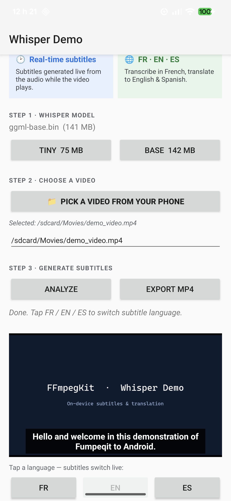
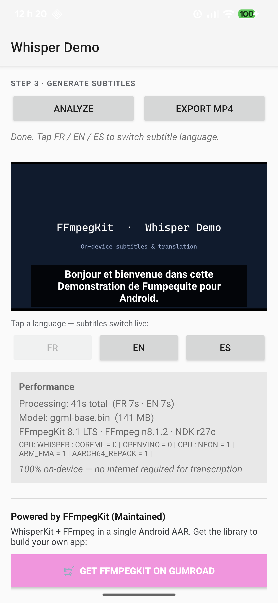
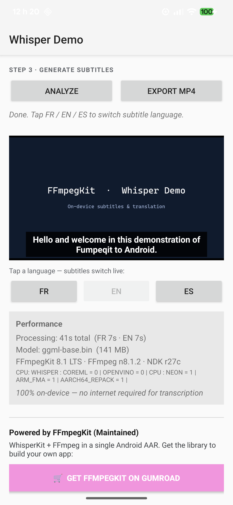

# WhisperKit Demo for Android — FFmpegKit (Maintained)

A small, self-contained Android app that shows how to use **[FFmpegKit (Maintained)](https://ffmpegkit.gumroad.com/l/sogbka)** end-to-end:

1. **FFmpegKit** extracts the audio track from a video (16 kHz mono PCM).
2. **WhisperKit** (bundled in the same AAR) transcribes and translates that audio **100 % on-device** — no cloud, no API key.
3. The app shows the video with **live subtitles** in **French / English / Spanish** (99 languages ​​are theoretically possible), and can **burn the subtitles back into an MP4** with FFmpegKit.

It is meant as a **learning sample**: short, commented, and easy to read. If you are new to Android, just follow the steps below in order.

> **The library powering this demo:** **FFmpegKit (Maintained)** — an actively maintained,
> Android-only fork of FFmpegKit (FFmpeg + WhisperKit in one AAR).
> 📦 Source & docs: **[github.com/ffmpegkit-maintained/ffmpeg-kit](https://github.com/ffmpegkit-maintained/ffmpeg-kit)** ·
> 
> 🛒 **🔥 Get Whisper + FFmpegKit ?**  
→ [Download Full GPL 8.1 with Whisper here](https://ffmpegkit.gumroad.com/l/sogbka)

---

## Screenshots

| Home — the two flagship features | Real-time subtitles (FR) | Live translation (EN) |
|:---:|:---:|:---:|
|  |  |  |

*Pick any video on your phone → Whisper generates subtitles **on-device**, then you switch
**FR / EN / ES** live. English translation is built into Whisper (offline); other languages use
LibreTranslate.*

---

## What you need

| Tool | Version | Notes |
|---|---|---|
| **Android Studio** | latest stable | https://developer.android.com/studio |
| **JDK** | 17 | Android Studio ships with a compatible JDK |
| **An Android device or emulator** | Android 7.0 (API 24) or higher, **arm64-v8a** | A physical phone is recommended for speed |

You do **not** need to build FFmpegKit yourself — you download a ready-made `.aar` file (next step).

---

## Step 1 — Get the FFmpegKit AAR from Gumroad

The native library is distributed as a single `.aar` file on Gumroad:

👉 **https://ffmpegkit.gumroad.com/l/sogbka**

1. Buy / download the **Full** package from the link above.
2. Unzip it if needed — you are looking for a file named like `ffmpeg-kit-full-*.aar`.
3. Copy that `.aar` into the app's `libs` folder:

   ```
   whisper-demo-android/
   └── app/
       └── libs/
           └── ffmpeg-kit-full-8.1.aar   ← drop the AAR here
   ```

That's it. The app is already configured to pick up **any** `.aar` placed in `app/libs/` (see `app/build.gradle`):

```gradle
dependencies {
    implementation fileTree(dir: 'libs', include: ['*.aar'])
    // smart-exception is a transitive dependency of FFmpegKit
    implementation 'com.arthenica:smart-exception-java:0.2.1'
}
```

> **Note:** the AAR is large and is intentionally **not** committed to this repository
> (`app/libs/` is in `.gitignore`). Every developer drops in their own copy from Gumroad.

---

## Step 2 — Open the project in Android Studio

1. Launch Android Studio → **File ▸ Open…**
2. Select the folder where you cloned this repository, for example:

   ```
   C:\Projects\whisper-demo-android
   ```

   (Any folder works — pick whatever is convenient on your machine. The examples in this
   README use `C:\Projects\...`, but a path like `~/Projects/whisper-demo-android` on macOS/Linux
   is equally fine.)
3. Wait for **Gradle sync** to finish (Android Studio does this automatically on first open).

If Gradle complains that it cannot find the library, double-check that the `.aar` from Step 1 is
really inside `app/libs/`.

---

## Step 3 — Run the app

1. Plug in an Android phone (with **USB debugging** enabled in *Settings ▸ Developer options*)
   **or** start an emulator.
2. Select your device in the toolbar and click **Run ▶** (`Shift+F10`).

The app installs and launches automatically.

### Building a shareable APK

To produce a standalone `.apk` you can hand to someone else:

```powershell
# Windows
.\gradlew.bat assembleDebug
```
```bash
# macOS / Linux
./gradlew assembleDebug
```

The APK lands in `app/build/outputs/apk/debug/app-debug.apk`.

> **⚠️ Licensing:** the built APK **bundles the FFmpegKit native libraries** from your
> Gumroad purchase. Do **not** publish that APK (or the `.aar`) in a public place — it would
> redistribute the paid library for free. Share it only through private/licensed channels.
> This is why `*.apk` and `app/libs/` are git-ignored.

---

## Using the app

The whole demo happens inside the app — no command line required.

1. **Download a Whisper model.** Tap **"Download tiny"** (fast, ~75 MB) or **"Download base"**
   (slower, more accurate). The models come from the
   [whisper.cpp model repository on Hugging Face](https://huggingface.co/ggerganov/whisper.cpp/tree/main)
   ([ggml-tiny.bin](https://huggingface.co/ggerganov/whisper.cpp/resolve/main/ggml-tiny.bin) ·
   [ggml-base.bin](https://huggingface.co/ggerganov/whisper.cpp/resolve/main/ggml-base.bin))
   and are stored privately inside the app.
2. **Pick a video.** Tap the **…** (browse) button and choose any video on your device.
3. **Analyze.** Tap **Analyze**. The app will, in order:
   - extract audio with FFmpegKit,
   - transcribe French subtitles with WhisperKit,
   - translate to English (Whisper's built-in translation),
   - translate to Spanish (best-effort, via a public LibreTranslate server — needs internet).
4. **Watch with subtitles.** The video plays with synchronized subtitles. Tap **FR / EN / ES**
   to switch the subtitle language live.
5. **Export.** Tap **Export** to burn the currently selected subtitles into a new MP4
   (saved in the app's external files folder; the on-screen message shows the exact path and an
   `adb pull` command to copy it to your computer).
6. **Translation.** English translation is produced by **Whisper itself, on-device** — no network
   needed. Translation to *other* languages (Spanish in this demo) is delegated to a
   [LibreTranslate](https://libretranslate.com/) server (the demo uses free public instances), so
   it is the only step that requires internet. You can point it at any LibreTranslate endpoint,
   including a self-hosted one.

Everything except the optional translation to languages other than English runs **fully offline**.
The English translation is offline too — it is built into Whisper.

---

## Optional — automated instrumented test

For power users / CI, `run_whisper_test.ps1` (Windows PowerShell) builds the app, installs it on a
connected device, pushes a sample video and a Whisper model, runs an instrumented test, and pulls
the generated subtitle files back to your computer.

```powershell
# From the project root, pass the video you want to caption:
.\run_whisper_test.ps1 -VideoPath "C:\Projects\whisper-demo-android\samples\demo_video.mp4"
```

The script auto-detects `adb` from your Android SDK (via `ANDROID_HOME` / `ANDROID_SDK_ROOT` or the
default SDK location) or from your `PATH`. Generated `.srt` files are written next to the video.

This script is **optional** — the normal way to try the demo is simply *Step 3 — Run the app*.

---

## How it works (architecture)

```
        ┌─────────────┐   audio    ┌──────────────┐   text/SRT   ┌──────────────┐
 Video ─▶  FFmpegKit  ├──────────▶ │  WhisperKit  ├────────────▶ │   VideoView  │
        │ (extract)   │  16kHz PCM │ (on-device)  │  FR/EN/ES    │  + subtitles │
        └─────────────┘            └──────────────┘              └──────┬───────┘
                                                                        │ export
                                                                 ┌──────▼───────┐
                                                                 │  FFmpegKit   │
                                                                 │ (burn subs)  │
                                                                 └──────────────┘
```

Key files to read if you want to learn from the sample:

| File | What it shows |
|---|---|
| `app/src/main/java/dev/ffmpegkit/test/MainActivity.java` | The full pipeline: FFmpegKit audio extraction, WhisperKit transcription/translation, subtitle playback, and subtitle burn-in. |
| `app/src/androidTest/.../WhisperKitInstrumentedTest.java` | A minimal headless example: PCM extraction → `transcribeToSrt` / `translateToSrt`. |
| `app/build.gradle` | How to consume the FFmpegKit AAR from `libs/`. |

---

## Troubleshooting

| Symptom | Fix |
|---|---|
| Gradle: *"Could not find ffmpeg-kit…"* | The `.aar` is missing from `app/libs/`. Re-do **Step 1**. |
| App says *"No model"* | Tap **Download tiny** or **Download base** first. |
| App crashes on an old / 32-bit device | This demo targets **arm64-v8a**. Use a 64-bit device or emulator. |
| Spanish subtitles say *"not available"* | The public LibreTranslate servers were unreachable. The video's original language or English always works completely offline.. |
| You see **two sets of subtitles**, or captions appear before you tap **Analyze** | Your device has **Live Caption** (a built-in Android/Pixel accessibility feature) turned on — it captions *any* audio system-wide and is unrelated to this app. The app cannot enable, disable, or control it. Turn it off via the **volume button → captions icon**, or **Settings → Accessibility → Live Caption**. |

> **Note on Live Caption.** "Live Caption" is a system feature of Android (notably on Pixel) that
> automatically captions any audio playing on the device — videos, podcasts, voice messages — across
> all apps. It is **completely separate** from this demo: the app has no microphone permission and no
> background service, so it cannot listen to other apps or enable Live Caption (that requires a
> system-level permission no normal app can hold). If Live Caption is on, you may see its captions
> *in addition to* the subtitles this app generates — that is the system, not the app.

---

Built with **FFmpegKit (Maintained)** — library source & docs:
[github.com/ffmpegkit-maintained/ffmpeg-kit](https://github.com/ffmpegkit-maintained/ffmpeg-kit) ·
get the AAR on [Gumroad](https://ffmpegkit.gumroad.com/l/sogbka)
